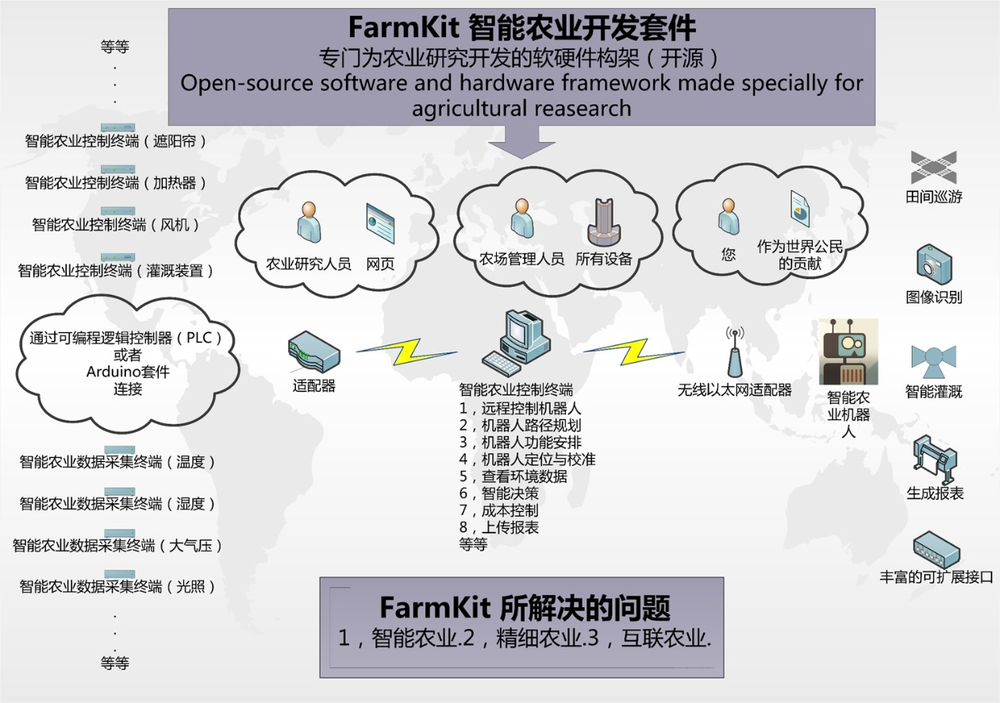

# FarmKit

*A software and hardware framework made specially for agricultural research*

> Welcome to watch our 30sec [Promotional Video](https://v.youku.com/v_show/id_XOTIyMTA4MDAw.html?spm=a2h0k.11417342.soresults.dtitle) and 7min [Introduction Video](https://v.youku.com/v_show/id_XOTIzNTY1OTg0.html?spm=a2h0k.11417342.soresults.dtitle)

**FarmKit** 是一套为农业研究和农业生产服务的软硬件设备，借助移动设备、云技术和大数据等当代互联网技术实现农场与管理人员，农场与研究人员，农场与企业的便捷，高效的连接。从而实现智能农业，精细农业和互联网农业。

FarmKit consists of three parts: Intelligent Agricultural Control Terminal, Robot Surveillance and Control System and the Greenhouse Control System. It focuses on the following three problems:

## Intelligent Agriculture
The monitoring system, which based on our intelligent agricultural robot, can be applied to places like vineyards and greenhouses. There are several data acquisition nodes on the robot, these nodes are connected to the Robot Surveillance and Control System via Modbus communication protocol, transmitting the collected environmental data like temperature, humidity and atmospheric pressure to the bus. That is to say, the real-time information like air temperature, air humidity, soil temperature, soil moisture, light intensity and carbon dioxide concentration that related to the growth of crops will be gathered to the Intelligent Agricultural Robot Control Terminal. As a result, researches can easily develop Expert Systems according to the Public data from the Internet, diagnosing the growth conditions and pest status of the crops with the help of these environmental parameters. For managers, they can take a better control of the blinds, fans, irrigation equipment through our Control Terminal and make their strategic decision, which makes intelligent management of agricultural production a reality. 

## Precision Agriculture
Instead of walking around the fields to do a lot of field work, farm managers now can just call the robots to do it and our robots can provide you with the exact information you want, therefore, it becomes a reality to achieve precision agriculture, which is a hot field of sustainable development of agriculture. The core of precision agriculture requires to collect the information of soil and crops in each plot and analyse the growth and the production of the crops from different plots. Mangers can make different decisions according to the results of the analysis so as to irrigate, fertilize and spray accurately. The robot can automatically adjust the ratio between water and fertilizer for the purpose of increasing production and reducing environmental pollution. Moreover, our intelligent agricultural robot gets detailed and thorough farming information, and it may help when facing many unknown problems.

## Internet Agriculture
FarmKit filter out the collected data(including temperature, humidity, atmospheric pressure and other environmental data, image data, image data based on the maturity of the fruit, the degree of pest)to ensure that the information is useful to agricultural researchers, farm workers and agriculture-related enterprises. That means people can easily get these shared data via the Internet only if they use the proper technology.

